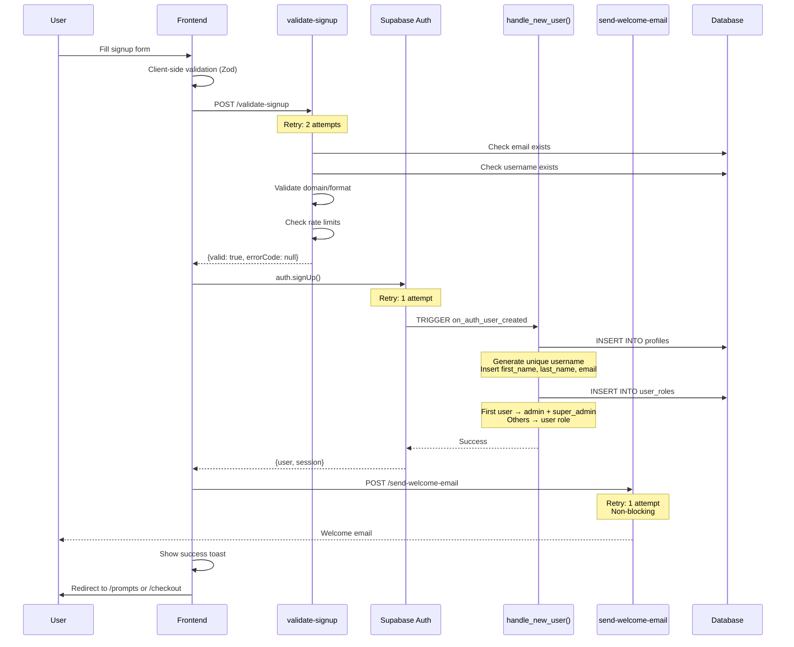
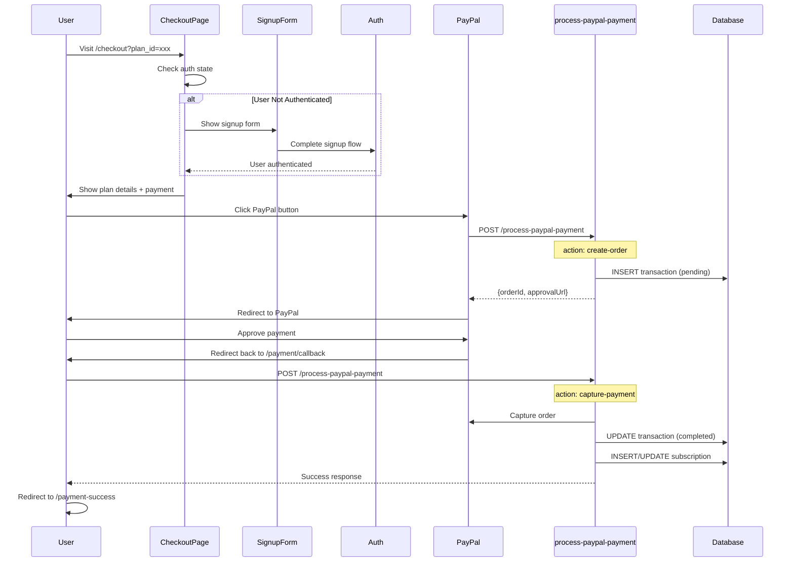
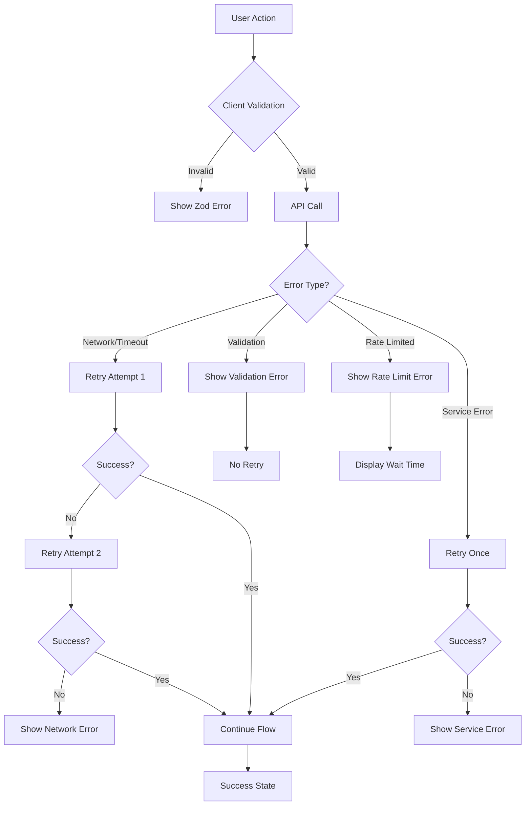

# JojoPrompts - Complete Signup Flow Documentation

**Version:** 1.0  
**Last Updated:** 2025-10-25  
**Status:** Production Ready

---

## Table of Contents

1. [Architecture Overview](#architecture-overview)
2. [Flow Diagrams](#flow-diagrams)
3. [Component Breakdown](#component-breakdown)
4. [Security Model](#security-model)
5. [Error Handling Strategy](#error-handling-strategy)
6. [Payment Integration](#payment-integration)
7. [Mobile Optimization](#mobile-optimization)
8. [Testing Guide](#testing-guide)
9. [Troubleshooting](#troubleshooting)

---

## Architecture Overview

### System Components

```
┌─────────────────────────────────────────────────────────────┐
│                     FRONTEND LAYER                          │
│  ┌──────────────┐  ┌──────────────┐  ┌──────────────┐     │
│  │ SignupPage   │  │ CheckoutPage │  │ LoginPage    │     │
│  │              │  │              │  │              │     │
│  │ useSignupForm│  │ SignupForm   │  │ useLoginForm │     │
│  └──────┬───────┘  └──────┬───────┘  └──────┬───────┘     │
│         │                 │                  │              │
└─────────┼─────────────────┼──────────────────┼──────────────┘
          │                 │                  │
          └─────────────────┴──────────────────┘
                            │
          ┌─────────────────▼──────────────────┐
          │      SUPABASE AUTH SERVICE         │
          │  ┌──────────────────────────────┐  │
          │  │   auth.signUp()              │  │
          │  │   auth.signIn()              │  │
          │  │   onAuthStateChange()        │  │
          │  └──────────────────────────────┘  │
          └─────────────────┬──────────────────┘
                            │
          ┌─────────────────▼──────────────────┐
          │         EDGE FUNCTIONS             │
          │  ┌──────────────────────────────┐  │
          │  │  validate-signup             │  │
          │  │  send-welcome-email          │  │
          │  │  process-paypal-payment      │  │
          │  └──────────────────────────────┘  │
          └─────────────────┬──────────────────┘
                            │
          ┌─────────────────▼──────────────────┐
          │      DATABASE LAYER                │
          │  ┌────────────┐  ┌──────────────┐  │
          │  │  profiles  │  │  user_roles  │  │
          │  ├────────────┤  ├──────────────┤  │
          │  │ id         │  │ user_id      │  │
          │  │ email      │  │ role         │  │
          │  │ username   │  │ is_super...  │  │
          │  │ first_name │  └──────────────┘  │
          │  │ last_name  │                     │
          │  └────────────┘                     │
          │                                     │
          │  ┌────────────┐  ┌──────────────┐  │
          │  │transactions│  │subscriptions │  │
          │  └────────────┘  └──────────────┘  │
          └─────────────────────────────────────┘
```

---

## Flow Diagrams

### 1. Standard Signup Flow



### 2. Checkout Flow with Signup



### 3. Error Handling Flow



---

## Component Breakdown

### Frontend Components

#### 1. **SignupPage** (`src/pages/SignupPage.tsx`)
- **Purpose**: Main signup entry point
- **Features**:
  - Email/password signup
  - Google OAuth integration
  - Plan information display (if from checkout)
  - Responsive mobile layout

#### 2. **useSignupForm** (`src/components/auth/hooks/useSignupForm.ts`)
- **Purpose**: Signup logic and state management
- **Features**:
  - Form validation with Zod
  - Retry logic for API calls (Phase 2)
  - Error handling with structured codes
  - Navigation after signup
- **Key Functions**:
  ```typescript
  handleSubmit(values: SignupFormValues): Promise<void>
  handleFormError(errors: any): void
  ```

#### 3. **CheckoutPage/SignupForm** (`src/components/checkout/components/SignupForm.tsx`)
- **Purpose**: Simplified signup in checkout flow
- **Features**:
  - Magic link authentication
  - Minimal form fields
  - Checkout context preservation

### Edge Functions

#### 1. **validate-signup**
- **Path**: `supabase/functions/validate-signup/index.ts`
- **Purpose**: Server-side validation before signup
- **Checks**:
  - ✅ Email format and domain validity
  - ✅ Email uniqueness
  - ✅ Username format (3-20 chars, alphanumeric + _ -)
  - ✅ Username uniqueness
  - ✅ Reserved username blocking (admin, superadmin, etc.)
  - ✅ Rate limiting (3 attempts per hour per IP)
  - ✅ Disposable email blocking
- **Returns**:
  ```typescript
  {
    valid: boolean;
    errors: string[];
    warnings?: string[];
    errorCode?: string; // PHASE 2
  }
  ```

#### 2. **send-welcome-email**
- **Path**: `supabase/functions/send-welcome-email/index.ts`
- **Purpose**: Send welcome email after signup
- **Features**:
  - Resend API integration
  - Personalized content
  - Non-blocking (doesn't fail signup)

#### 3. **process-paypal-payment**
- **Path**: `supabase/functions/process-paypal-payment/index.ts`
- **Purpose**: Handle PayPal payment processing
- **Actions**:
  - `create-order`: Initialize PayPal transaction
  - `capture-payment`: Complete payment and create subscription

### Database Layer

#### Trigger: **handle_new_user()**
```sql
CREATE FUNCTION public.handle_new_user()
RETURNS TRIGGER
LANGUAGE plpgsql
SECURITY DEFINER
SET search_path = public
AS $$
DECLARE
  is_first_user BOOLEAN;
  generated_username TEXT;
BEGIN
  -- Check if this is the first user
  SELECT COUNT(*) = 0 INTO is_first_user FROM profiles;
  
  -- Generate username if not provided
  generated_username := COALESCE(
    NEW.raw_user_meta_data->>'username',
    'user_' || substr(NEW.id::text, 1, 8)
  );
  
  -- Insert profile
  INSERT INTO public.profiles (
    id, 
    email, 
    first_name, 
    last_name, 
    username
  )
  VALUES (
    NEW.id,
    NEW.email,
    NEW.raw_user_meta_data->>'first_name',
    NEW.raw_user_meta_data->>'last_name',
    generated_username
  );
  
  -- Insert user role
  INSERT INTO public.user_roles (
    user_id,
    role,
    is_super_admin
  )
  VALUES (
    NEW.id,
    CASE WHEN is_first_user THEN 'admin'::app_role 
         ELSE 'user'::app_role 
    END,
    is_first_user
  );
  
  RETURN NEW;
END;
$$;
```

---

## Security Model

### 1. Role-Based Access Control (RBAC)

**Architecture Principle:** Roles are NEVER stored in `profiles` or client storage.

```sql
-- Separate table for roles
CREATE TABLE user_roles (
  user_id UUID REFERENCES auth.users(id),
  role app_role NOT NULL,
  is_super_admin BOOLEAN DEFAULT FALSE
);

-- Security definer function to check roles
CREATE FUNCTION has_role(_user_id UUID, _role app_role)
RETURNS BOOLEAN
LANGUAGE SQL
STABLE
SECURITY DEFINER
SET search_path = public
AS $$
  SELECT EXISTS (
    SELECT 1 FROM user_roles
    WHERE user_id = _user_id AND role = _role
  )
$$;
```

### 2. Row-Level Security (RLS)

**All tables have RLS enabled:**

```sql
-- Profiles: Users can read own, admins can read all
CREATE POLICY "Users can read own profile"
  ON profiles FOR SELECT
  USING (auth.uid() = id);

CREATE POLICY "Admins can read all profiles"
  ON profiles FOR SELECT
  USING (has_role(auth.uid(), 'admin'));

-- Transactions: Users can read own
CREATE POLICY "Users can view own transactions"
  ON transactions FOR SELECT
  USING (auth.uid() = user_id);
```

### 3. Reserved Username Protection

**Blocked Usernames:**
- admin, administrator, root, system
- superadmin, support, help, info, contact
- jojo, jojoprompts, moderator, mod

**Blocked Prefixes:**
- admin*, mod_*, system*

### 4. Email Validation

**Blocked Domains:**
- Temporary email services (tempmail.com, 10minutemail.com, etc.)
- Invalid TLDs (.test, .local, .invalid, .example)

---

## Error Handling Strategy

### Phase 2 Enhancements

#### Error Categories

| Category | Retryable | Max Retries | Delay | Examples |
|----------|-----------|-------------|-------|----------|
| Validation | ❌ No | 0 | - | Email taken, invalid format |
| Network | ✅ Yes | 2 | 2s | Fetch failed, timeout |
| Service | ✅ Yes | 1 | 2s | 503, edge function error |
| Auth | ⚠️ Partial | 1 | 2s | Signup failed |
| Rate Limit | ✅ Yes | 0 | 60s | Too many attempts |

#### Error Codes

```typescript
enum SignupErrorCode {
  // Validation (not retryable)
  EMAIL_INVALID = 'EMAIL_INVALID',
  EMAIL_TAKEN = 'EMAIL_TAKEN',
  USERNAME_INVALID = 'USERNAME_INVALID',
  USERNAME_TAKEN = 'USERNAME_TAKEN',
  USERNAME_RESERVED = 'USERNAME_RESERVED',
  
  // Network (retryable)
  NETWORK_ERROR = 'NETWORK_ERROR',
  TIMEOUT = 'TIMEOUT',
  
  // Service (retryable)
  SERVICE_UNAVAILABLE = 'SERVICE_UNAVAILABLE',
  EDGE_FUNCTION_ERROR = 'EDGE_FUNCTION_ERROR',
  
  // Auth
  AUTH_SIGNUP_FAILED = 'AUTH_SIGNUP_FAILED',
  EMAIL_SEND_FAILED = 'EMAIL_SEND_FAILED',
  
  // Rate limiting
  RATE_LIMITED = 'RATE_LIMITED',
}
```

#### User-Facing Messages

**Good Error Messages:**
- ✅ "This email is already registered. Try logging in instead."
- ✅ "Username must be 3-20 characters and can only contain letters, numbers, and underscores."
- ✅ "Connection error. Please check your internet and try again."

**Bad Error Messages:**
- ❌ "Error: 400"
- ❌ "Something went wrong"
- ❌ "Invalid input"

---

## Payment Integration

### PayPal Flow

#### 1. Order Creation
```typescript
{
  action: "create-order",
  planId: "uuid",
  userId: "uuid",
  appliedDiscount?: {
    id: "uuid",
    code: "DISCOUNT_CODE",
    discount_type: "percentage" | "fixed",
    discount_value: number
  }
}
```

#### 2. Payment Capture
```typescript
{
  action: "capture-payment",
  orderId: "PayPal_Order_ID",
  userId: "uuid"
}
```

#### 3. Transaction States

```
PENDING → User created order
    ↓
COMPLETED → Payment captured, subscription created
    ↓
FAILED → Payment failed or declined
```

### Discount Handling

**Types:**
- `percentage`: Reduces price by X% (e.g., 99% off = 0.8 from 80)
- `fixed`: Reduces price by fixed amount (e.g., $10 off)

**Validation:**
- Checked in `process-paypal-payment` edge function
- Must be active and valid for the plan
- Applied before PayPal order creation

---

## Mobile Optimization

### Responsive Design

**Breakpoints:**
```css
xs: '480px'   /* Extra small mobile */
sm: '640px'   /* Small mobile */
md: '768px'   /* Tablet */
lg: '1024px'  /* Desktop */
xl: '1280px'  /* Large desktop */
```

### Mobile-Specific Classes

```typescript
// Touch targets (minimum 44px)
className="min-h-[44px] min-w-[44px]"

// Mobile buttons
className="mobile-button-primary"
className="mobile-button-secondary"

// Mobile cards
className="mobile-card"

// Mobile forms
className="mobile-form-field"
```

### iOS Considerations

```css
/* Safe area handling */
padding-top: env(safe-area-inset-top);
padding-bottom: env(safe-area-inset-bottom);

/* Touch optimization */
-webkit-touch-callout: none;
-webkit-overflow-scrolling: touch;
touch-action: manipulation;
```

### Testing Devices

**Required Testing:**
- iPhone 12/13/14 (iOS Safari)
- Samsung Galaxy S21/S22 (Chrome)
- iPad Air/Pro (Safari)
- Android Tablet (Chrome)

**Test Scenarios:**
1. Signup form completion
2. Payment flow
3. Keyboard interactions
4. Touch gestures
5. Orientation changes
6. Network offline/online

---

## Testing Guide

### Manual Testing Checklist

#### Signup Flow
- [ ] Valid email/password creates account
- [ ] Invalid email shows error
- [ ] Duplicate email shows "already registered"
- [ ] Username validation (3-20 chars, alphanumeric)
- [ ] Reserved usernames blocked
- [ ] Password requirements enforced
- [ ] First user gets admin role
- [ ] Subsequent users get user role
- [ ] Welcome email sent
- [ ] Profile created in database
- [ ] Role created in user_roles table

#### Error Handling
- [ ] Network error triggers retry
- [ ] Validation error fails immediately
- [ ] Rate limiting shows wait time
- [ ] Service error retries once
- [ ] Email failure doesn't block signup

#### Payment Flow
- [ ] PayPal button appears
- [ ] Order creation successful
- [ ] Payment capture successful
- [ ] Transaction recorded
- [ ] Subscription created
- [ ] Discount applied correctly
- [ ] Redirect to success page

#### Mobile
- [ ] Forms usable on small screens
- [ ] Buttons touchable (44px minimum)
- [ ] Keyboard doesn't overlap inputs
- [ ] Orientation change works
- [ ] Safari iOS works
- [ ] Chrome Android works

### SQL Verification

```sql
-- Verify new user created correctly
SELECT 
  p.id,
  p.email,
  p.username,
  p.first_name,
  p.last_name,
  ur.role,
  ur.is_super_admin,
  p.created_at
FROM profiles p
LEFT JOIN user_roles ur ON p.id = ur.user_id
ORDER BY p.created_at DESC
LIMIT 5;

-- Check transaction and subscription
SELECT 
  t.id,
  t.user_id,
  t.plan_id,
  t.status,
  t.amount,
  s.status as subscription_status,
  s.start_date,
  s.end_date
FROM transactions t
LEFT JOIN subscriptions s ON t.user_id = s.user_id
WHERE t.user_id = 'USER_ID'
ORDER BY t.created_at DESC;
```

---

## Troubleshooting

### Common Issues

#### 1. "Email already exists" but user can't login
**Cause:** Email exists in profiles but not in auth.users  
**Solution:** 
```sql
-- Check both tables
SELECT email FROM auth.users WHERE email = 'user@example.com';
SELECT email FROM profiles WHERE email = 'user@example.com';

-- If only in profiles, delete the orphaned profile
DELETE FROM profiles WHERE email = 'user@example.com' AND id NOT IN (SELECT id FROM auth.users);
```

#### 2. User created but no role assigned
**Cause:** Trigger failed or didn't fire  
**Solution:**
```sql
-- Check if role exists
SELECT * FROM user_roles WHERE user_id = 'USER_ID';

-- Manually assign if missing
INSERT INTO user_roles (user_id, role, is_super_admin)
VALUES ('USER_ID', 'user', false);
```

#### 3. Payment completed but no subscription
**Cause:** Edge function error during subscription creation  
**Solution:** Check edge function logs and manually create:
```sql
INSERT INTO subscriptions (
  user_id, plan_id, status, start_date, end_date
)
VALUES (
  'USER_ID', 'PLAN_ID', 'active', NOW(), NOW() + INTERVAL '1 month'
);
```

#### 4. Welcome email not received
**Cause:** Non-blocking, may have failed silently  
**Solution:** Check Resend dashboard or manually resend via edge function

---

## Performance Metrics

### Target Response Times
- Validation: <500ms
- Signup: <2s
- Payment order: <1s
- Payment capture: <3s

### Success Rates (Target)
- Signup completion: >95%
- Payment success: >98%
- Email delivery: >99%
- First-attempt success: >90%

---

## Maintenance

### Regular Tasks
- [ ] Review error logs weekly
- [ ] Check rate limiting effectiveness
- [ ] Monitor signup conversion rate
- [ ] Update reserved username list
- [ ] Review disposable email domains
- [ ] Test payment flow monthly

### Monitoring Queries

```sql
-- Signup success rate (last 7 days)
SELECT 
  DATE(created_at) as date,
  COUNT(*) as total_signups,
  COUNT(CASE WHEN error_messages IS NULL THEN 1 END) as successful,
  ROUND(COUNT(CASE WHEN error_messages IS NULL THEN 1 END) * 100.0 / COUNT(*), 2) as success_rate
FROM signup_audit_log
WHERE created_at > NOW() - INTERVAL '7 days'
GROUP BY DATE(created_at)
ORDER BY date DESC;

-- Payment completion rate
SELECT 
  DATE(created_at) as date,
  COUNT(*) as total_transactions,
  COUNT(CASE WHEN status = 'completed' THEN 1 END) as completed,
  ROUND(COUNT(CASE WHEN status = 'completed' THEN 1 END) * 100.0 / COUNT(*), 2) as completion_rate
FROM transactions
WHERE created_at > NOW() - INTERVAL '7 days'
GROUP BY DATE(created_at)
ORDER BY date DESC;
```

---

**Document Version:** 1.0  
**Last Review:** 2025-10-25  
**Next Review:** 2025-11-25  
**Maintained By:** Development Team
